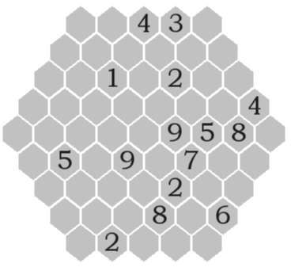

<!-- START doctoc generated TOC please keep comment here to allow auto update -->
<!-- DON'T EDIT THIS SECTION, INSTEAD RE-RUN doctoc TO UPDATE -->
## 目录

- [蜂巢数独](#%E8%9C%82%E5%B7%A2%E6%95%B0%E7%8B%AC)
  - [目录](#%E7%9B%AE%E5%BD%95)
  - [规则](#%E8%A7%84%E5%88%99)
    - [标签](#%E6%A0%87%E7%AD%BE)
  - [题型名](#%E9%A2%98%E5%9E%8B%E5%90%8D)
  - [题库](#%E9%A2%98%E5%BA%93)
    - [在线题库](#%E5%9C%A8%E7%BA%BF%E9%A2%98%E5%BA%93)

<!-- END doctoc generated TOC please keep comment here to allow auto update -->

# 蜂巢数独

## 目录

- [规则](蜂巢数独.md#规则)
  - [标签](蜂巢数独.md#标签)
- [题型名](蜂巢数独.md#题型名)
- [题库](蜂巢数独.md#题库)
  - [在线题库](蜂巢数独.md#在线题库)

## 规则

|  序号 |               限制区域              | 限制规则                                                                          |   备注   |
| :-: | :-----------------------------: | ----------------------------------------------------------------------------- | :----: |
|  1  |                行                | [连续区间限制](../../rules/rules.md#连续区间限制)，[1\~9不重复](../../rules/rules.md#1to9不重复) |   9 行  |
|  2  | [上斜线](../../rules/rules.md#上斜线) | [连续区间限制](../../rules/rules.md#连续区间限制)，[1\~9不重复](../../rules/rules.md#1to9不重复) | 9 条上斜线 |
|  3  | [下斜线](../../rules/rules.md#下斜线) | [连续区间限制](../../rules/rules.md#连续区间限制)，[1\~9不重复](../../rules/rules.md#1to9不重复) | 9 条下斜线 |

### 标签

- \#蜂巢
- \#斜线
- \#计算/减法/连续/连续区间

## 题型名

- 蜂巢数独
- HaniDoku

## 题库

### 在线题库

- [独·数之道](http://www.sudokufans.org.cn/lx/comb.index.php) 【需要登录】
