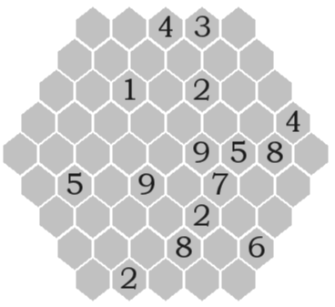

# 蜂巢数独

## 规则

| 序号  | 限制区域  | 限制规则     |   备注   |
|:---:|:-----:|:---------|:------:|
|  1  |   行   | [1~9不重复] |  9 行   |
|  2  | [上斜线] | [1~9不重复] | 9 条上斜线 |
|  3  | [下斜线] | [1~9不重复] | 9 条下斜线 |

## 题型名

- 蜂巢数独
- HaniDoku

## 题库

### 在线题库

- [独·数之道](http://www.sudokufans.org.cn/lx/comb.index.php) 【需要登录】

[1~9不重复]: ../../rules.md#1to9不重复

[上斜线]: ../../rules.md#上斜线

[下斜线]: ../../rules.md#下斜线
