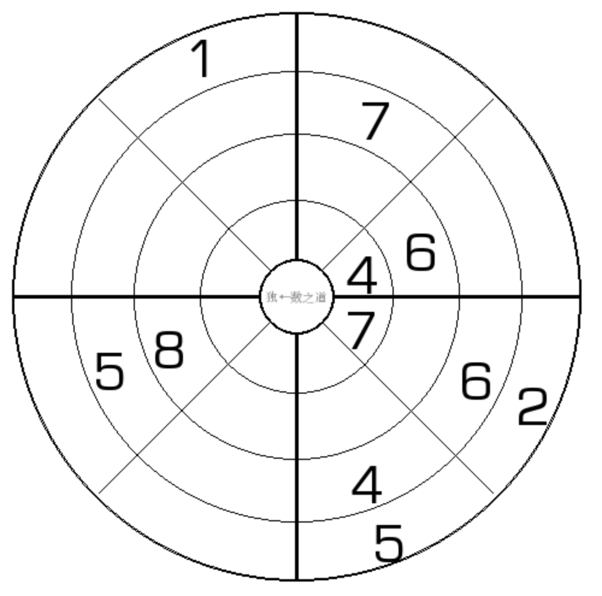

# 8靶数独
<!-- START doctoc generated TOC please keep comment here to allow auto update -->
<!-- DON'T EDIT THIS SECTION, INSTEAD RE-RUN doctoc TO UPDATE -->
## 目录

- [规则](#%E8%A7%84%E5%88%99)
  - [标签](#%E6%A0%87%E7%AD%BE)
- [题库](#%E9%A2%98%E5%BA%93)
  - [在线题库](#%E5%9C%A8%E7%BA%BF%E9%A2%98%E5%BA%93)

<!-- END doctoc generated TOC please keep comment here to allow auto update -->

## 规则

| 序号  | 限制区域 | 限制规则    |       备注       |
|:---:|:----:|:--------|:--------------:|
|  1  |  直径  | [1~8填充] |   4（或无数） 条直径   |
|  2  |  环   | [1~8填充] |      4 个环      |
|  3  | 1/4圆 | [1~8填充] | 横竖分隔的 4 个 1/4圆 |

### 标签

- [[靶子]]

## 题库

### 在线题库

- [独·数之道](http://www.sudokufans.org.cn/lx/game.index.php?type=qq) 【需要登录】

[1~8填充]: ../../rules.md#1to8填充
