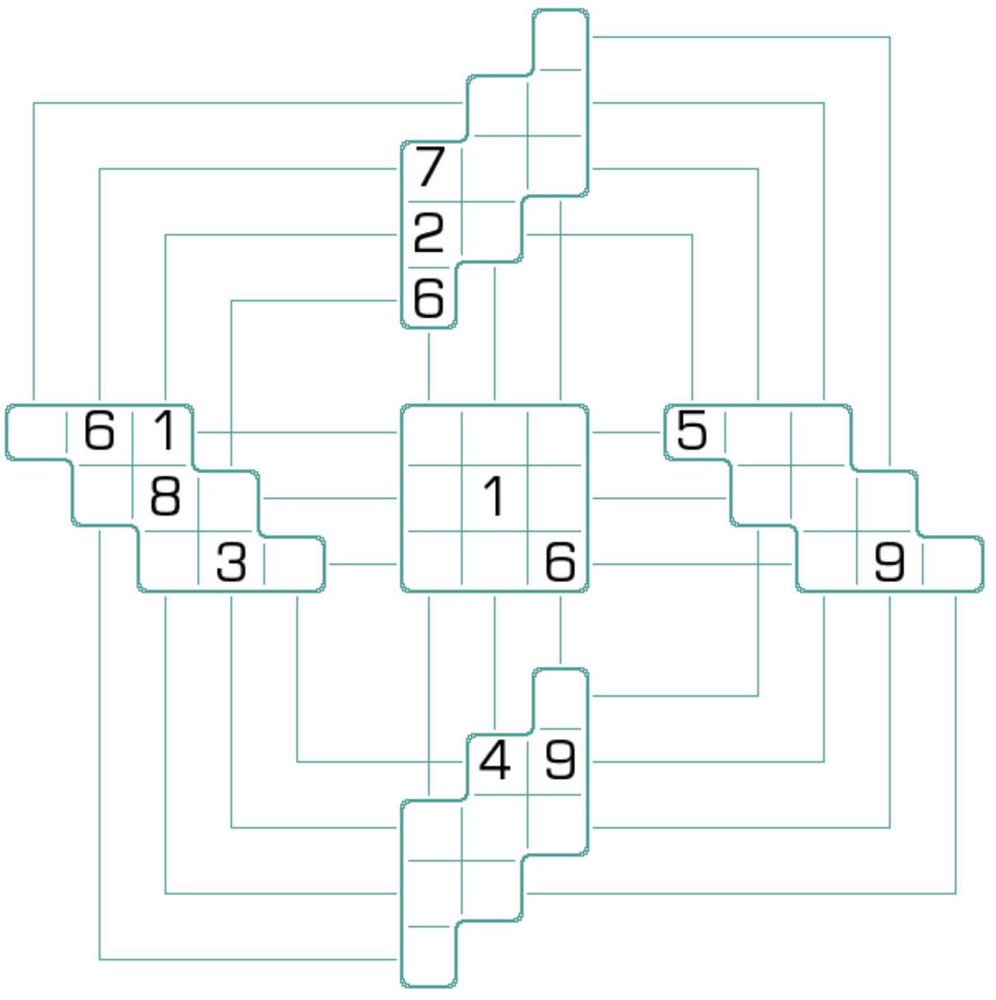

# 动感风车数独
<!-- START doctoc generated TOC please keep comment here to allow auto update -->
<!-- DON'T EDIT THIS SECTION, INSTEAD RE-RUN doctoc TO UPDATE -->

<!-- END doctoc generated TOC please keep comment here to allow auto update -->

## 规则

| 序号  | 限制区域 | 限制规则                |  备注  |
|:---:|:----:|:--------------------|:----:|
|  1  |  行   | [1~9填充]             | 3 行  |
|  2  |  列   | [1~9填充]             | 3 列  |
|  3  | 异形宫  | [1~9填充]             | 5 个宫 |
|  4  | 风车线  | [1~9填充] 1+2+3+2+1 格 | 4 条线 |

### 标签

- #风车

## 题库

### 在线题库

- [独·数之道](http://www.sudokufans.org.cn/lx/game.index.php?type=fc3) 【需要登录】

[1~9填充]: ../../rules/rules.md#1to9填充
