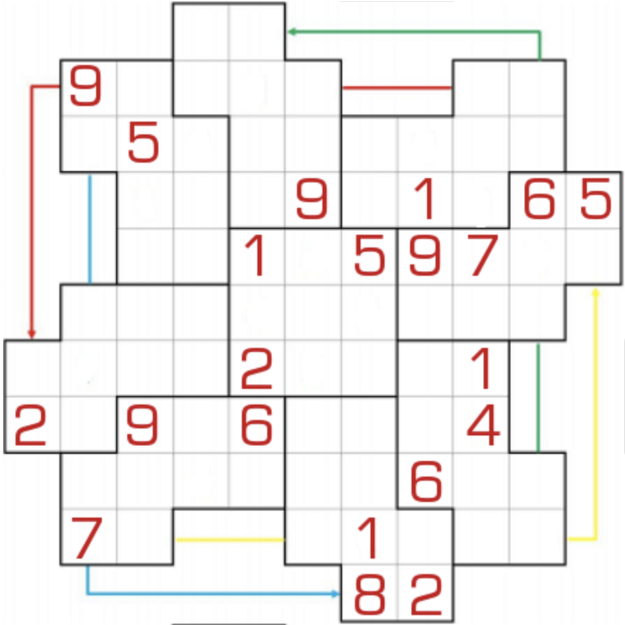

# 圆风车数独
<!-- START doctoc generated TOC please keep comment here to allow auto update -->
<!-- DON'T EDIT THIS SECTION, INSTEAD RE-RUN doctoc TO UPDATE -->
## 目录

- [规则](#%E8%A7%84%E5%88%99)
  - [标签](#%E6%A0%87%E7%AD%BE)
- [题库](#%E9%A2%98%E5%BA%93)
  - [在线题库](#%E5%9C%A8%E7%BA%BF%E9%A2%98%E5%BA%93)

<!-- END doctoc generated TOC please keep comment here to allow auto update -->

## 规则

| 序号  | 限制区域 | 限制规则              |  备注  |
|:---:|:----:|:------------------|:----:|
|  1  |  行   | [1~9不重复]          | 11 行 |
|  2  |  列   | [1~9不重复]          | 11 列 |
|  3  | 异形宫  | [1~9填充]           | 9 个宫 |
|  4  | 风车线  | [1~9填充] 2+3+2+2 格 | 4 条线 |

### 标签

- #风车

## 题库

### 在线题库

- [独·数之道](http://www.sudokufans.org.cn/lx/game.index.php?type=fc6) 【需要登录】

[1~9不重复]: ../../rules/rules.md#1to9不重复

[1~9填充]: ../../rules/rules.md#1to9填充
