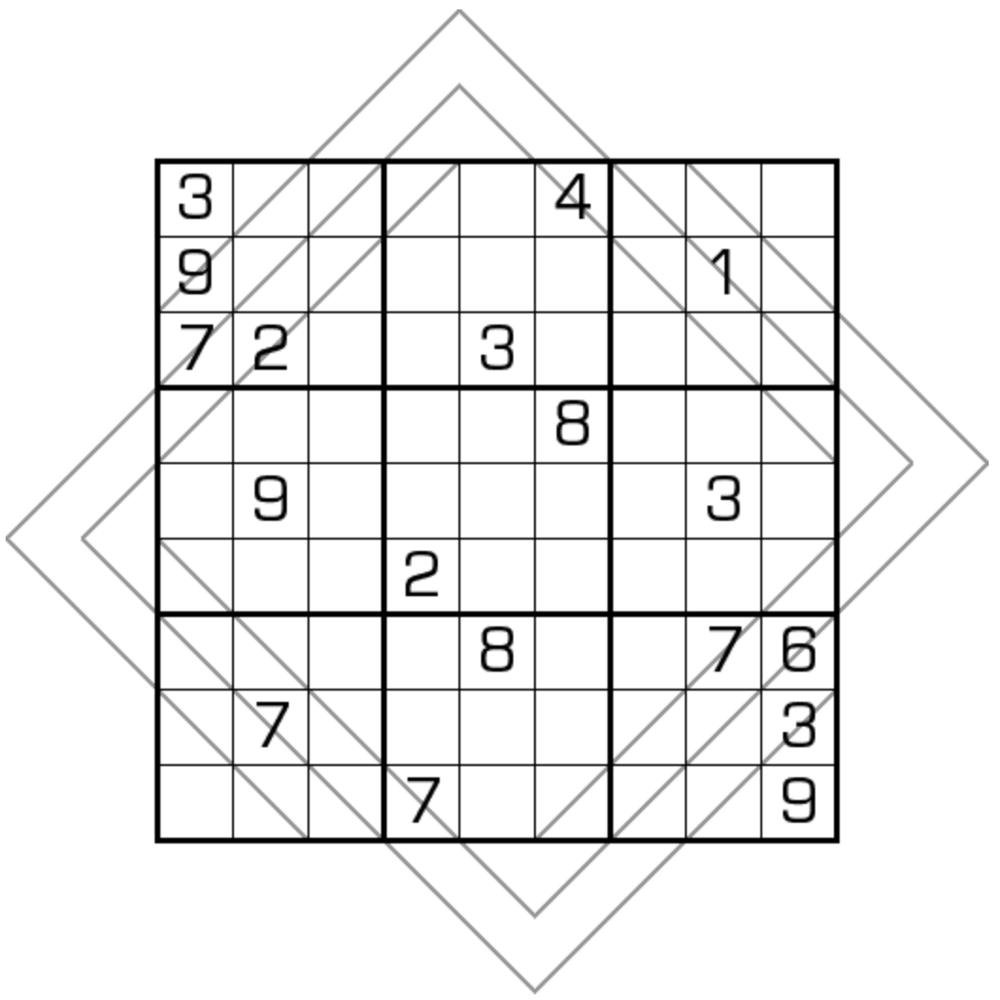

# 大风车数独

## 目录

* [规则](大风车数独.md#规则)
  * [标签](大风车数独.md#标签)
* [题库](大风车数独.md#题库)
  * [在线题库](大风车数独.md#在线题库)

## 规则

|  序号 | 限制区域 | 限制规则                                          |  备注  |
| :-: | :--: | --------------------------------------------- | :--: |
|  1  |   行  | [1\~9填充](../../rules/rules.md#1to9填充)         |      |
|  2  |   列  | [1\~9填充](../../rules/rules.md#1to9填充)         |      |
|  3  |   宫  | [1\~9填充](../../rules/rules.md#1to9填充)         |      |
|  4  |  风车线 | [1\~9填充](../../rules/rules.md#1to9填充) 2+3+4 格 | 4 条线 |

### 标签

* \#风车

## 题库

### 在线题库

* [独·数之道](http://www.sudokufans.org.cn/lx/game.index.php?type=fc2) 【需要登录】
