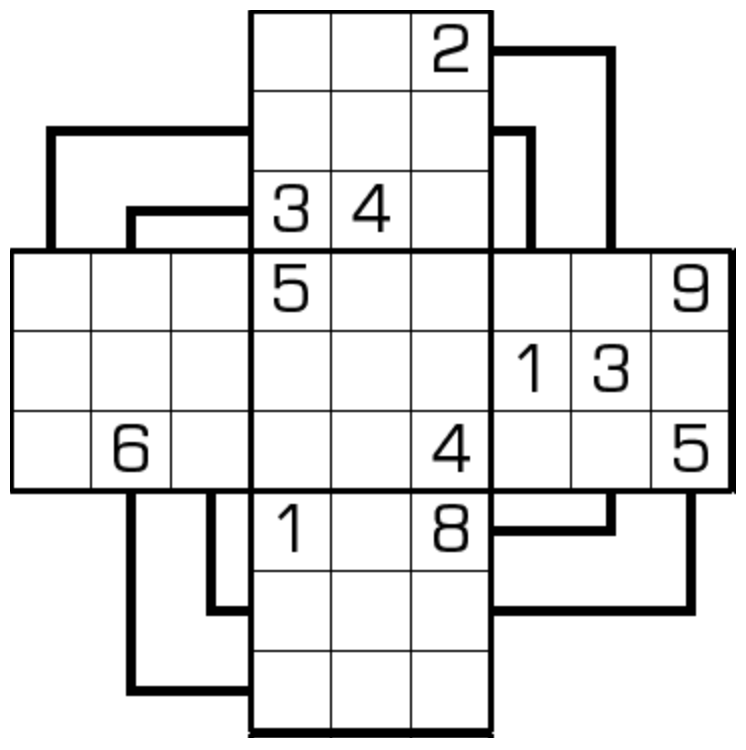

# 规则
| 序号 | 限制区域 | 限制规则 | 备注 |
| :---: | :---: | :--- | :---: |
| 1 | 行 | [1~9填充] | 3 行 |
| 2 | 列 | [1~9填充] | 3 列 |
| 3 | 宫 | [1~9填充] | 5 个宫|
| 4 | 风车线 | [1~9填充] 3+3+3 格| 4 条线 |

# 别名
- 管道数独

# 题库

## 在线题库
- [独·数之道](http://www.sudokufans.org.cn/lx/game.index.php?type=fc1) 【需要登录】

[1~9填充]: ../../rules.md#1to9填充