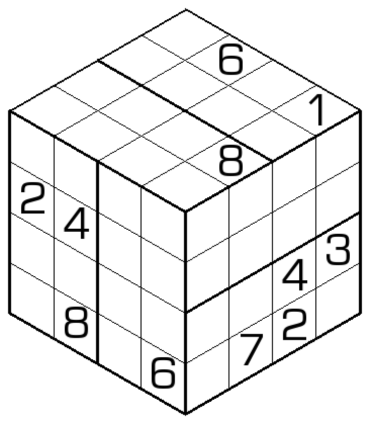

# 三面数独
<!-- START doctoc generated TOC please keep comment here to allow auto update -->
<!-- DON'T EDIT THIS SECTION, INSTEAD RE-RUN doctoc TO UPDATE -->

<!-- END doctoc generated TOC please keep comment here to allow auto update -->

## 规则

| 序号  | 限制区域 | 限制规则    |  备注   |
|:---:|:----:|:--------|:-----:|
|  1  |  宫   | [1~8填充] | 8 个宫  |
|  2  | [棱]  | [1~8填充] | 12 条棱 |

### 标签

- #魔方

## 题库

### 在线题库

- [独·数之道](http://www.sudokufans.org.cn/lx/game.index.php?type=3d) 【需要登录】

[1~8填充]: ../../rules/rules.md#1to8填充

[棱]: ../../rules/rules.md#棱
