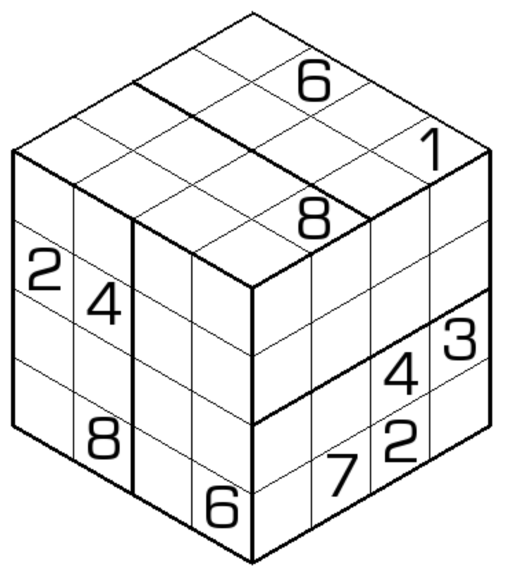

# 三面数独

## 目录

* [规则](三面数独.md#规则)
  * [标签](三面数独.md#标签)
* [题库](三面数独.md#题库)
  * [在线题库](三面数独.md#在线题库)

## 规则

|  序号 |             限制区域            | 限制规则                                  |   备注  |
| :-: | :-------------------------: | ------------------------------------- | :---: |
|  1  |              宫              | [1\~8填充](../../rules/rules.md#1to8填充) |  8 个宫 |
|  2  | [棱](../../rules/rules.md#棱) | [1\~8填充](../../rules/rules.md#1to8填充) | 12 条棱 |

### 标签

* \#魔方

## 题库

### 在线题库

* [独·数之道](http://www.sudokufans.org.cn/lx/game.index.php?type=3d) 【需要登录】
