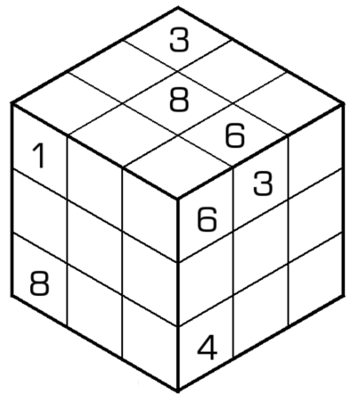
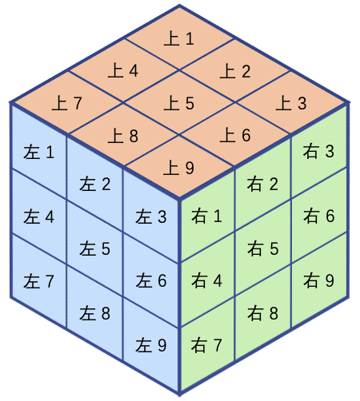

# 不连续魔方

## 规则

| 序号  | 限制区域 | 限制规则                                               |  备注  |
|:---:|:----:|:---------------------------------------------------|:----:|
|  1  |  宫   | [1~9填充]                                           | 3 个宫 |
|  2  | [棱]  | [1~9不重复]   | 9 条棱 |
|  3  |  全盘  | 任意[共边邻格]的差 ≠ 1（即不满足[连续]约束）                         |  无标  |

### 方位描述

- 宫
  - 上宫
  - 左宫
  - 右宫
- 格
  - 

## 题库

### 在线题库

- [独·数之道](http://www.sudokufans.org.cn/lx/game.index.php?type=ncmf) 【需要登录】

[1~9填充]: ../../rules.md#1to9填充
[棱]: ../../rules.md#棱
[1~9不重复]: ../../rules.md#1to9不重复
[连续]: ../../rules.md#连续
[共边邻格]: ../../rules.md#共边邻格
