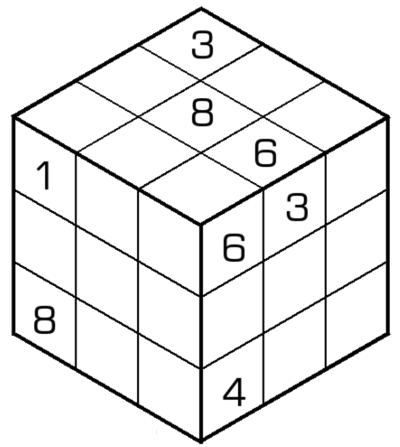
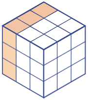
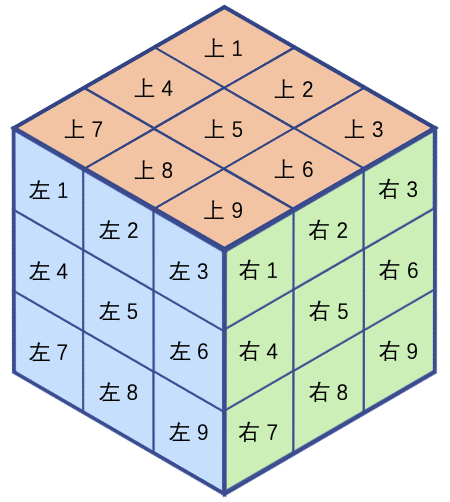

# 不连续魔方

## 目录

* [规则](不连续魔方.md#规则)
  * [方位描述](不连续魔方.md#方位描述)
  * [标签](不连续魔方.md#标签)
* [题库](不连续魔方.md#题库)
  * [在线题库](不连续魔方.md#在线题库)

## 规则

|  序号 |             限制区域            | 限制规则                                                                                                        |  备注  |
| :-: | :-------------------------: | ----------------------------------------------------------------------------------------------------------- | :--: |
|  1  |              宫              | [1\~9填充](../../rules/rules.md#1to9填充)                                                                       | 3 个宫 |
|  2  | [棱](../../rules/rules.md#棱) | 
<a href="../../rules/rules.md#1to9不重复">1~9不重复</a> 
 | 9 条棱 |
|  3  |              全盘             | 任意[共边邻格](../../rules/rules.md#共边邻格)的差 ≠ 1（即不满足[连续](../../rules/rules.md#连续)约束）                              |  无标  |

### 方位描述

* 宫
  * 上宫
  * 左宫
  * 右宫
* 格
  * 

### 标签

* \#魔方

## 题库

### 在线题库

* [独·数之道](http://www.sudokufans.org.cn/lx/game.index.php?type=ncmf) 【需要登录】
