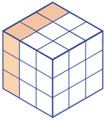

# 不连续魔方
<!-- START doctoc generated TOC please keep comment here to allow auto update -->
<!-- DON'T EDIT THIS SECTION, INSTEAD RE-RUN doctoc TO UPDATE -->
## 目录

- [规则](#%E8%A7%84%E5%88%99)
  - [方位描述](#%E6%96%B9%E4%BD%8D%E6%8F%8F%E8%BF%B0)
  - [标签](#%E6%A0%87%E7%AD%BE)
- [题库](#%E9%A2%98%E5%BA%93)
  - [在线题库](#%E5%9C%A8%E7%BA%BF%E9%A2%98%E5%BA%93)

<!-- END doctoc generated TOC please keep comment here to allow auto update -->

## 规则

| 序号  | 限制区域 | 限制规则                                               |  备注  |
|:---:|:----:|:---------------------------------------------------|:----:|
|  1  |  宫   | [1~9填充]                                            | 3 个宫 |
|  2  | [棱]  | [1~9不重复]   | 9 条棱 |
|  3  |  全盘  | 任意[共边邻格]的差 ≠ 1（即不满足[连续]约束）                         |  无标  |

### 方位描述

- 宫
  - 上宫
  - 左宫
  - 右宫
- 格
  - 

### 标签

- [[魔方]]

## 题库

### 在线题库

- [独·数之道](http://www.sudokufans.org.cn/lx/game.index.php?type=ncmf) 【需要登录】

[1~9填充]: ../../rules.md#1to9填充

[棱]: ../../rules.md#棱

[1~9不重复]: ../../rules.md#1to9不重复

[连续]: ../../rules.md#连续

[共边邻格]: ../../rules.md#共边邻格
